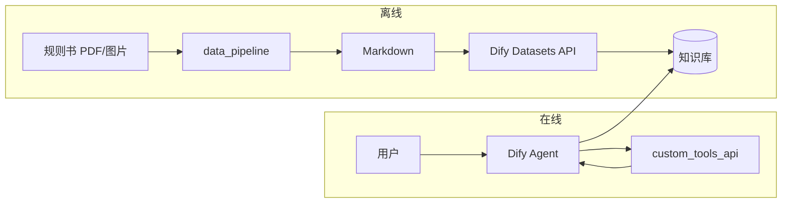

# dify-boardgame-rule-agent

基于 [Dify](https://github.com/langgenius/dify) 的「桌游规则问答」智能体项目。重点覆盖：**数据预处理**（规则书 → 结构化 Markdown → 知识库）、**确定性工具 API**（计分、校验、随机等），以及 **Dify 配置即代码（As Code）** 的可维护工作流。

---

## 项目简介

本仓库将桌游规则以 RAG 形式接入大模型对话，并通过本地 HTTP 工具弥补纯生成式模型在**精确计算、状态校验、可复现随机**等方面的不足。数据流大致为：

1. 离线：图片 / PDF 规则书 → Vision LLM 转写 → 标准 Markdown → Dify Datasets API 写入知识库。
2. 在线：Dify Agent 检索知识库并结合 Tool 调用（OpenAPI）完成问答与规则相关操作。

后续可在 `data_pipeline` 之上扩展带可视化的 **Admin Web** 后台；当前仓库以脚本与 API 骨架为主。

---

## 核心架构

| 层级 | 目录 / 组件 | 职责 |
|------|----------------|------|
| **大脑与知识库** | 外部部署的 Dify | Agent、RAG、工作流编排；通过 API 与知识库交互。 |
| **数据准备** | `data_pipeline/` | 离线脚本：Vision LLM 转 Markdown、调用 Dify Datasets API 注入知识库。 |
| **确定性工具** | `custom_tools_api/` | 本地 REST API（计分器、购卡条件、骰子等），提供 OpenAPI 供 Dify Agent 绑定为 Tool。 |
| **配置固化** | `dify_config/` | 从 Dify 导出的应用 / 工作流 YAML，版本化与 Code Review。 |



---

## 目录结构

```
dify-boardgame-rule-agent/
├── README.md                 # 本文件
├── LICENSE                   # MIT 许可证
├── .gitignore                # Git 忽略规则（含原始资源、环境变量、解释器缓存等）
│
├── data_pipeline/            # 数据准备层（离线）
│   ├── raw/                  # 原始 PDF / 图片（目录保留，内容默认不提交）
│   ├── output/               # 转换后的 Markdown 等中间/产出（可按需纳入版本控制）
│   ├── prompt_templates/     # Vision LLM 转 Markdown 用的系统提示词模板
│   └── scripts/              # 转换、清洗、入库脚本
│
├── custom_tools_api/         # 确定性工具层（本地 API）
│   ├── openapi/              # OpenAPI YAML（供 Dify 导入为 Tool）
│   └── src/                  # 服务实现（Python / Node 等，后续初始化时选定）
│
└── dify_config/              # 配置固化层（As Code）
    ├── apps/                 # Dify 应用导出（若按应用维度管理）
    └── workflows/            # 工作流 YAML 导出
```

说明：

- **`data_pipeline/raw`**：仅用于放置原始规则书素材；`.gitignore` 默认忽略该目录下除 `.gitkeep` 外的文件，避免大文件进入仓库。
- **`data_pipeline/prompt_templates`**：存放 Vision LLM 将页面/图片转为结构化 Markdown 时使用的系统提示词（便于版本管理与 A/B 调优）。
- **`custom_tools_api/openapi`**：与实现语言解耦，便于在 Dify 控制台直接填写 Base URL 与 Schema。
- **`dify_config`**：建议与 Dify 实例变更同步更新，并在 PR 中说明变更原因。

---

## 快速开始（占位）

以下步骤在依赖与脚本落地后补充具体命令；当前为占位，便于后续一键对接。

### 1. 环境准备

- 部署或可访问的 **Dify** 实例，并创建应用、知识库（Dataset）。
- 准备 **Vision LLM** 的 API Key（与 `data_pipeline` 脚本中调用方式一致）。
- （可选）Python 3.10+ 或 Node LTS，用于运行 `data_pipeline` 与 `custom_tools_api`。

### 2. 配置环境变量

```bash
cp .env.example .env
# 编辑 .env 填入真实密钥与端点
```

建议在 `.env` 中配置（名称仅供参考）：

- `DIFY_API_KEY` / `DIFY_BASE_URL`：调用 Dify 与 Datasets API。
- `VISION_API_KEY` / `VISION_BASE_URL`：Vision LLM 转写规则书。

**切勿将 `.env` 提交到 Git。**

### 3. 数据管道（占位）

1. 将规则书 PDF 或图片放入 `data_pipeline/raw/`。
2. 运行 `data_pipeline/scripts/` 下转换脚本（待实现）生成 Markdown 至 `data_pipeline/output/`。
3. 调用 Dify Datasets API 将文档写入目标知识库（待实现）。

### 4. 启动自定义工具 API（占位）

```bash
# 进入 custom_tools_api/src，按选定技术栈安装依赖并启动（待补充）
# 将 OpenAPI 文件路径或内容提供给 Dify Agent 的 Tool 配置
```

### 5. 导入 Dify 配置（占位）

1. 在 Dify 中关联知识库与 Tool（指向 `custom_tools_api` 暴露的地址）。
2. 将导出 YAML 保存到 `dify_config/workflows/` 或 `dify_config/apps/`，并提交到本仓库。

---

## 贡献与约定（建议）

- 配置与提示词变更尽量通过 `dify_config` 可追溯，避免仅在线上控制台修改。
- 工具接口保持**幂等与可测试**：输入输出在 OpenAPI 中写清楚，便于 Agent 稳定调用。
- 原始规则书版权归权利人所有；本仓库仅提供工程化流程，请遵守授权与使用范围。

---

## 许可证

本项目采用 [MIT License](LICENSE) 授权。

## 远程仓库

- GitHub：<https://github.com/shitlsh/dify-boardgame-rule-agent>
